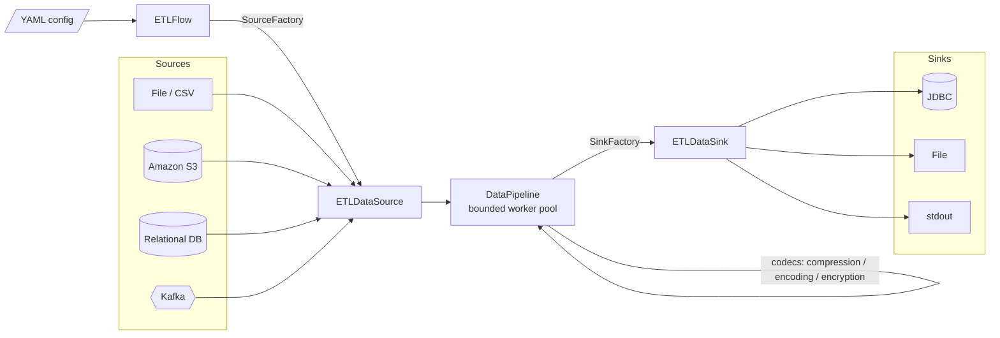

<div align="center">

# 🌊 Data Drift

**A config-driven ETL framework in Java — one YAML file describes the entire pipeline.**

Extract from files, Amazon S3, relational databases, or Kafka · transform · load into JDBC, files, or stdout — batch or streaming, no code changes required.


-02303A?logo=gradle&logoColor=white)


</div>

---

## Overview

**Data Drift** is a lightweight, extensible **Extract–Transform–Load** framework built in modern Java (21). Instead of writing bespoke code for every integration, you declare the **source**, **transformation**, and **sink** in a single YAML file and run the pipeline. The engine wires up the right connectors, applies optional compression / encoding / encryption, and streams records through a bounded, back-pressured worker pool.

It is designed as a **reference implementation** of clean ETL architecture — Factory and Adapter patterns throughout, connectors that plug in without touching the core, and a runtime that scales to the host's available cores.

## Table of Contents

- [Highlights](#highlights)
- [Architecture](#architecture)
- [How It Works](#how-it-works)
- [Connectors & Formats](#connectors--formats)
- [Getting Started](#getting-started)
- [Usage](#usage)
- [Configuration Reference](#configuration-reference)
- [Project Structure](#project-structure)
- [Roadmap](#roadmap)
- [Contributing](#contributing)
- [License](#license)
- [Author](#author)

## Highlights

- **🧾 Config-driven** — the whole pipeline (source → transform → sink) lives in one YAML file; swap integrations without recompiling.
- **🔌 Pluggable connectors** — File, Amazon S3, JDBC/relational DB, and Kafka sources; JDBC, File, and stdout sinks. New connectors drop in behind a factory.
- **🔀 Batch & streaming** — choose `etlMode: batch` or `etlMode: streaming` per pipeline.
- **🗜️ Built-in codecs** — transparent GZIP / BZIP2 / ZIP compression and ASCII / Base64 / URL / UTF-8 encoding.
- **🔐 S3 encryption** — SSE-S3, SSE-KMS, SSE-C, and client-side AES-256, selected from config.
- **⚙️ Concurrent by design** — a bounded `ThreadPoolExecutor` sized to available processors, with a caller-runs policy for natural back-pressure.
- **🏊 Connection pooling** — JDBC sources and sinks use c3p0 pooling for throughput.
- **🧩 Extensible core** — Factory + Adapter patterns keep sources, sinks, codecs, and crypto independent and easy to extend.

## Architecture



**Design notes**

- `Entrypoint` → `ETLFlow` loads the config, resolves the mode, and builds the source/sink graph via `SourceFactory` / `SinkFactory`.
- `DataPipeline` runs records through a `ThreadPoolExecutor` (core = CPU count, max = 2× CPU, bounded queue, `CallerRunsPolicy` for back-pressure) and drains cleanly on completion.
- Cross-cutting concerns are Adapters selected by factories: `CompressionAdapterFactory`, `EncodingAdapterFactory`, `EncryptionAdapterFactory` — so new codecs never touch connector code.

## How It Works

A pipeline is fully described by one YAML file:

```yaml
etlMode: "batch"              # batch | streaming

source:
  type: "file"               # file | s3 | db | kafka
  path: "data/data.csv"

transformation:
  type: "custom"
  logic:
    - "filter: column_name > 100"
    - "map: column_name -> column_name * 2"

sink:
  type: "db"                 # db | file | s3 (stdout if omitted)
  dbConfig:
    driverName: "org.postgresql.Driver"
    url: "jdbc:postgresql://localhost:5432/postgres"
    username: "postgres"
    password: "password"
    table: "user_data"
    schemaName: "public"
```

Run it:

```bash
java -jar build/libs/data-drift-1.0-SNAPSHOT-all.jar config/source/file/file-source-to-db-sink.yml
# equivalently: java -cp <jar> org.example.Entrypoint <config.yml>
```

## Connectors & Formats

| Category | Supported |
|---|---|
| **Sources** | File (CSV) · Amazon S3 · Relational DB (JDBC) · Kafka |
| **Sinks** | JDBC (e.g. PostgreSQL) · File · stdout (default) |
| **Modes** | Batch · Streaming |
| **Compression** | GZIP · BZIP2 · ZIP · none |
| **Encoding** | ASCII · Base64 · URL · UTF-8 |
| **S3 encryption** | SSE-S3 · SSE-KMS · SSE-C · AES-256 (client-side) |
| **S3 auth** | IAM role · access keys · session token · named profile |

## Getting Started

### Prerequisites

- **Java 21+**
- **Docker** (for the local Postgres / Kafka setup helpers)
- **Netcat** & **Git**

### Build

```bash
git clone https://github.com/lumos9/data-drift.git
cd data-drift
./gradlew clean build
```

The Shadow plugin produces a self-contained fat JAR at `build/libs/data-drift-1.0-SNAPSHOT-all.jar`.

## Usage

Each example below runs a complete pipeline from a bundled config file.

### 1 · File → PostgreSQL (batch)

```bash
# Start a local Postgres (skip if you already have one)
setup/db/jdbc/postgres/setup-pg.sh
nc -vz localhost 5432   # expect: Connection to localhost port 5432 ... succeeded!

java -jar build/libs/data-drift-1.0-SNAPSHOT-all.jar config/source/file/file-source-to-db-sink.yml
```

### 2 · Amazon S3 → PostgreSQL (batch)

```bash
setup/db/jdbc/postgres/setup-pg.sh
java -jar build/libs/data-drift-1.0-SNAPSHOT-all.jar config/source/s3/aws-s3-source-to-db-sink.yml
```

### 3 · Amazon S3 → stdout (batch)

```bash
java -jar build/libs/data-drift-1.0-SNAPSHOT-all.jar config/source/s3/aws-s3-source-to-stdout-sink.yml
```

### 4 · PostgreSQL → stdout (batch)

```bash
setup/db/jdbc/postgres/setup-pg.sh
java -jar build/libs/data-drift-1.0-SNAPSHOT-all.jar config/source/db/db-source.yml
```

### 5 · Kafka → stdout (streaming)

```bash
# Terminal 1 — start Kafka (Docker; ~16 GB RAM recommended)
setup/kafka/launch_kafka.sh

# Terminal 2 — run the consumer pipeline
java -jar build/libs/data-drift-1.0-SNAPSHOT-all.jar config/source/kafka/kafka-source.yml

# Terminal 3 — produce sample events
./kafka-producer-to-broker.sh
```

## Configuration Reference

| Key | Description |
|---|---|
| `etlMode` | `batch` or `streaming`. |
| `source.type` | `file` · `s3` · `db` · `kafka`. |
| `source.path` | File path or S3 object key. |
| `source.region`, `source.bucketName` | S3 location. |
| `source.auth` | S3 auth: `iam-role` · `access-keys` · `session-token` (+ optional `profile`). |
| `source.compressionConfig` | `enabled` + `compressionType` (`GZIP`/`BZIP2`/`ZIP`). |
| `source.encryptionConfig` | `enabled` + `encryptionType` (`SSE-S3`/`SSE-KMS`/`SSE-C`/`NONE`) + key material. |
| `source.kafkaConfig` | `bootstrapServers`, `topic`, `groupId`, `autoOffsetReset`, … |
| `source.dbConfig` | `driverName`, `url`, `username`, `password`, `query`/`table`, `schemaName`. |
| `transformation` | `type` + declarative `logic` (filter / map). |
| `sink.type` | `db` · `file` · `s3` (defaults to stdout if omitted). |
| `sink.dbConfig` | JDBC target: `url`, credentials, `table`, `schemaName`. |

Ready-to-run examples live under [`config/`](config/).

## Project Structure

```
data-drift/
├── src/main/java/org/example/
│   ├── Entrypoint.java            # CLI entry — takes a config path
│   ├── ETLFlow.java               # loads config, resolves mode, builds the graph
│   ├── pipeline/DataPipeline.java # bounded, back-pressured worker pool
│   ├── source/                    # File, S3, JDBC, Kafka + SourceFactory
│   ├── sink/                      # JDBC, File, Stdout + SinkFactory
│   ├── compression/               # GZIP, BZIP2, ZIP + factory
│   ├── encode/                    # ASCII, Base64, URL, UTF-8 + factory
│   ├── security/                  # SSE-KMS, SSE-C, AES-256 + factory
│   ├── config/                    # typed config model + ConfigLoader
│   └── datagen/                   # sample e-commerce data generator
├── config/                        # example pipeline definitions
└── setup/                         # Docker helpers for Postgres, Kafka, HDFS
```

## Roadmap

- Expanded transformation library (joins, aggregations, schema mapping).
- Additional sinks (S3 writer, Snowflake, object stores).
- Secrets-manager integration for credentials.
- Pluggable parsers (JSON, TSV, delimited, XML).
- Checkpointing and at-least-once delivery for streaming mode.

## Contributing

Contributions are welcome!

1. Fork the repo and create a branch: `git checkout -b feature/your-feature`
2. Commit your changes: `git commit -m "Add your feature"`
3. Push and open a pull request.

For bugs or ideas, please open an issue with enough detail to reproduce.

## License

Released under the **MIT License**. See [`LICENSE`](LICENSE).

## Author

**Nageswar** — Lead Software Engineer · distributed data systems & applied AI
🌐 [nagc.dev](https://nagc.dev) · 💼 [LinkedIn](https://linkedin.com/in/nageswar-c-295732126) · ✉️ [nchat.dev@proton.me](mailto:nchat.dev@proton.me)
